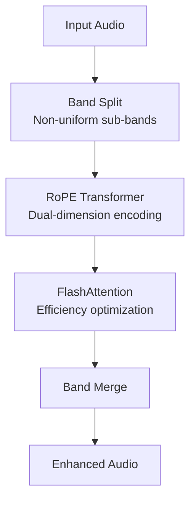
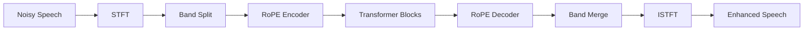
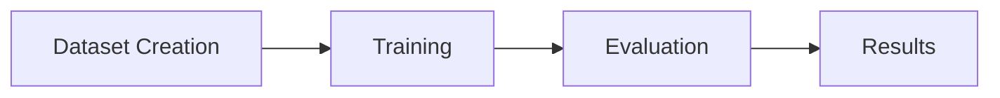
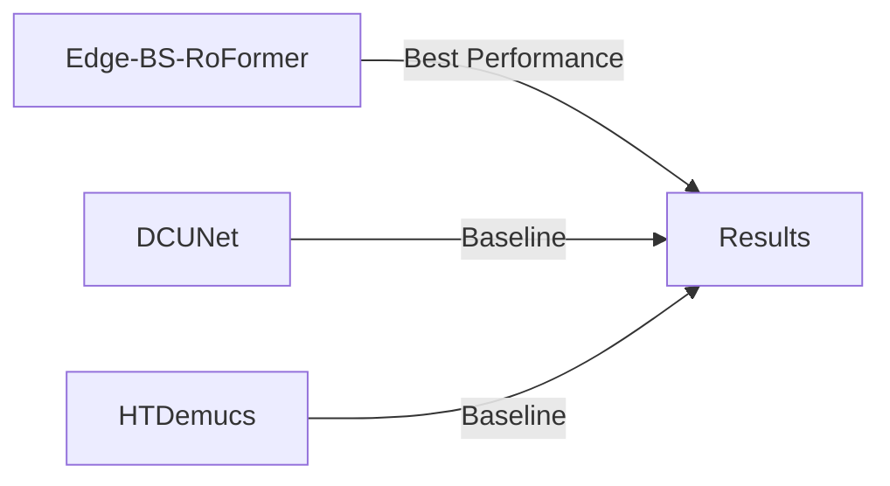
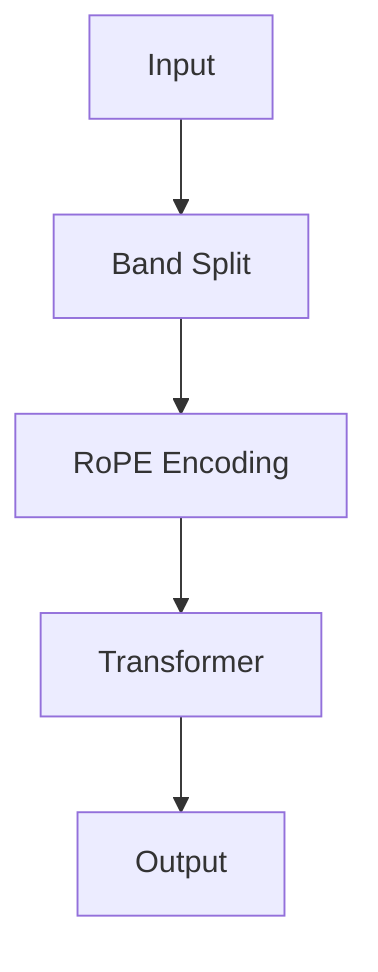

# Generate Slidev Presentations

Generates Slidev presentations from user descriptions, automatically creating approach/explanation slides with mermaid diagrams and results slides using `generate_comparison.py`.

## Quick Start

When the user describes slides they want:

1. **Determine slide type**: Approach/explanation vs Results
2. **For approach slides**: Use mermaid diagrams or find relevant illustrations
3. **For results slides**: Ask user for model selections and generate comparison plots
4. **Generate Slidev presentation**: Create `slides.md` with all slides

## Workflow

### Step 1: Analyze User Request

Parse the user's slide description to identify:
- **Approach/Explanation slides**: Methodology, architecture, dataset, etc.
- **Results slides**: Performance comparisons, metrics, evaluations

### Step 2: Handle Approach/Explanation Slides

For approach/explanation slides:

1. **Search for existing illustrations**:
   - Check `docs/` directory for relevant diagrams
   - Look for architecture descriptions in README or code comments
   - Check if user provided context with illustrations
   - Review model code in `models/edge_bs_rof/` for architecture details

2. **If no illustrations found, create mermaid diagrams**:
   - Use Slidev's mermaid support
   - Create appropriate diagrams (flowchart, graph, classDiagram, etc.)
   - **Key architecture components** (from README/Abstract):
     - Band-split strategy (non-uniform sub-bands)
     - Dual-dimension Rotary Position Encoding (RoPE)
     - FlashAttention for efficiency
     - Transformer architecture
   - Examples:
     - Architecture: `graph TD` or `flowchart LR`
     - Process: `sequenceDiagram` or `flowchart`
     - Model structure: `graph` or `classDiagram`

### Step 3: Handle Results Slides

For results slides:

1. **Ask user for model selection**:
   ```
   Which models should be compared in this results slide?
   Available models: Edge-BS-RoFormer, DCUNet, DPTNet, HTDemucs, Diffusion-Buffer-BBED
   ```

2. **Ask about audio samples** (if relevant):
   ```
   Would you like to include a slide with spectrograms and listenable audio samples?
   If yes, which sample IDs should be used? (e.g., 00000, 00001)
   ```

3. **Generate comparison plots**:
   ```bash
   # Sync results first
   ./sync_results.sh

   # Generate comparison plots
   python generate_comparison.py \
       --models <selected_models> \
       --output_dir slides/assets/comparison_<slide_number> \
       --plot_name comparison.png

   # If audio samples requested
   python generate_comparison.py \
       --models <selected_models> \
       --samples <sample_ids> \
       --output_dir slides/assets/audio_<slide_number>
   ```

4. **Add slides to presentation**:
   - Include generated plots in Slidev slides
   - Reference audio files if generated
   - Add captions and descriptions

## Slidev Template Structure

Create `slides.md` with this structure:

```markdown
---
theme: default
background: https://source.unsplash.com/1920x1080/?technology
class: text-center
highlighter: shiki
lineNumbers: false
info: |
  Edge-BS-RoFormer Presentation
drawings:
  persist: false
transition: slide-left
title: Edge-BS-RoFormer Presentation
mdc: true
---

# Title Slide

---

# Slide Content

Use Slidev features:
- `---` for slide breaks
- `:::` for columns
- `v-click` for animations
- `mermaid` code blocks for diagrams
```

## Mermaid Diagram Examples

### Architecture Diagram
```markdown

```

### Edge-BS-RoFormer Architecture
```markdown

```

### Process Flow
```markdown

```

### Model Comparison
```markdown

```

## Common Slide Types

### Title Slide
```markdown
---
layout: cover
---

# Edge-BS-RoFormer
## Edge-Deployed Band-Split RoPE Transformer
### For Ultra-Low SNR UAV Speech Enhancement
```

### Approach Slide
```markdown
# Approach


```

### Results Slide
```markdown
# Results Comparison

<div class="grid grid-cols-2 gap-4">
<div>

## Metrics Comparison


</div>
<div>

## Key Findings

- Edge-BS-RoFormer outperforms baselines
- 2.2 dB SI-SDR improvement
- 0.15 PESQ enhancement

</div>
</div>
```

### Audio Sample Slide
```markdown
# Audio Sample Comparison

<div class="grid grid-cols-2 gap-4">

<div v-for="sample in ['00000', '00001']" :key="sample">

## Sample {sample}


<audio controls>
  <source :src="`assets/audio_1/sample_${sample}_vocals.wav`" type="audio/wav">
</audio>

</div>

</div>
```

## Implementation Steps

When user requests a presentation:

1. **Parse slide descriptions**:
   - Identify slide types (approach vs results)
   - Extract key topics

2. **For approach slides**:
   - Search docs/README for relevant content
   - Create mermaid diagrams if needed
   - Add appropriate slide content

3. **For results slides**:
   - **Ask user**: "Which models should be compared?"
   - **Ask user**: "Include audio samples? Which sample IDs?"
   - Run `generate_comparison.py` with user selections
   - Add slides with generated plots

4. **Generate `slides.md`**:
   - Use Slidev markdown format
   - Include all slides
   - Reference generated assets correctly

5. **Create asset directories**:
   - `slides/assets/` for comparison plots
   - `slides/assets/audio_*/` for audio comparisons

## Example Interaction

**User**: "Create a presentation with: 1) Title slide, 2) Approach explanation, 3) Results comparing Edge-BS-RoFormer vs DCUNet and HTDemucs, 4) Audio samples slide"

**Agent**:
1. Creates title slide
2. Creates approach slide with mermaid diagram
3. Asks: "For the results slide, should I compare Edge-BS-RoFormer, DCUNet, and HTDemucs?"
4. Asks: "For audio samples, which sample IDs? (e.g., 00000, 00001)"
5. Runs `generate_comparison.py` commands
6. Generates `slides.md` with all slides

## File Structure

```
slides/
├── slides.md              # Main Slidev presentation
├── assets/
│   ├── comparison_1/     # Comparison plots for slide 1
│   │   └── comparison.png
│   └── audio_1/          # Audio comparison plots
│       ├── sample_00000_comparison.png
│       └── sample_00001_comparison.png
└── public/               # Static assets (if needed)
```

## Notes

- **Always sync results first**: Run `./sync_results.sh` before generating results slides
- **Model names**: Use exact names: Edge-BS-RoFormer, DCUNet, DPTNet, HTDemucs, Diffusion-Buffer-BBED
- **Sample IDs**: Use 5-digit format (00000, 00001, etc.)
- **Slidev installation**: User needs Slidev installed (`npm install -g @slidev/cli`)
- **Running presentation**: `slidev slides.md` in the slides directory. To run and visually inspect slides (e.g. with browser MCP), use the **examine-presentation-slides** skill.
- **Mermaid support**: Slidev has built-in mermaid support, use ` ```mermaid` code blocks

## Error Handling

If results not synced:
```
Error: Evaluation directory not found
Hint: Run './sync_results.sh' first
```

If invalid models:
```
Error: Invalid model names
Available: Edge-BS-RoFormer, DCUNet, DPTNet, HTDemucs, Diffusion-Buffer-BBED
```
