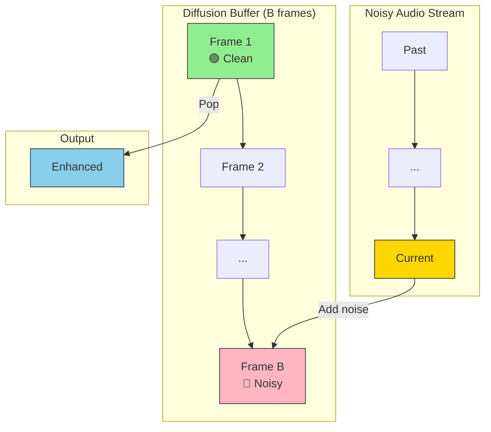
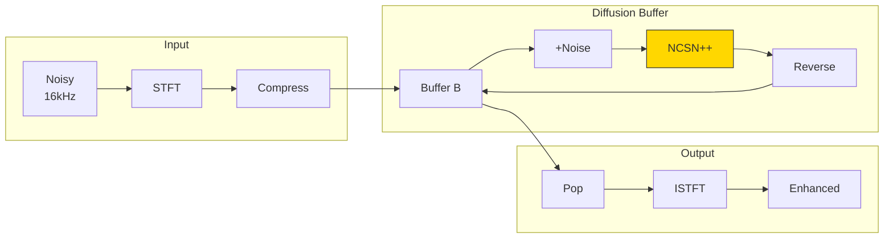

# Edge-BS-RoFormer Progress Update

## UAV Speech Enhancement Research

  
    Weekly Progress Report
  

---

# What Was Done This Week

## Edge-BS-RoFormer Fixes

- Investigated and fixed several training issues
- Experimented with different hyperparameter configurations
- **Result**: Fixes did not lead to significant improvement

## Diffusion Buffer Implementation

- Reimplemented **Diffusion Buffer** model from scratch
- Based on: *"Diffusion Buffer: Online Diffusion-based Speech Enhancement"*
- Applied to the DroneNoise-LibriMix dataset
- Currently debugging training issues

---

# Diffusion Buffer: Key Idea

**Problem**: Standard diffusion models are **too slow**
- Multiple score model calls per frame required
- RTF >> 1 → real-time processing impossible

**Diffusion Buffer solution**:
- Align diffusion time-steps with physical time
- Introduce a **buffer of B frames**
- Frames closer to present → more noise
- Frames further in past → progressively denoised
- **Only one score model call** per input frame!

**Trade-off**: Buffer size B controls latency vs quality
- Latency = hop_size × B
- Achievable: **320-960ms** latency

**Key insight**: By aligning diffusion steps with time, we amortize the cost of denoising across multiple frames

---
layout: center
---

# Diffusion Buffer: Concept Diagram

---

# Diffusion Buffer: Training & Inference

## Training Process

1. Sample clean/noisy pair from dataset
2. Pad with K-1 leading zeros (init)
3. Randomly crop K=128 frames (~2s)
4. Sample ascending time-steps t⃗
5. Compute perturbed input V^t⃗
6. Optimize denoising score matching loss

## Online Inference

1. Initialize empty buffer V^t⃗
2. For each new frame R in stream:
   - Pop first frame → output
   - Append R + σ_tB·Z to buffer end
   - Run **one reverse step** for all frames
3. Output delay = hop_size × B

**Key advantage**: Score model called only **once** per hop → real-time processing

---
layout: center
---

# Diffusion Buffer: Architecture Flow

---
layout: default
class: compact-table
---

# BBED SDE Configuration

**SDE Parameters**

| Param | Value |
|-------|-------|
| Type | BBED |
| c | 0.08 |
| k | 2.6 |
| T | 0.8 |
| t_eps | 0.03 |

**Audio**: SR=16kHz, Win=510, Hop=256

**NCSN++ Network**

| Param | Orig | Red |
|-------|------|-----|
| Ch | 128 | 96 |
| Blocks | 6 | 4 |
| Res | 2 | 1 |
| Params | 65M | 18M |

**Training**: Adam, LR=1e-4, Batch=32

**Key Design Choices**

- Reduced network → faster inference
- Single score call per frame
- Buffer size B controls latency
- BBED SDE: fewer steps needed

**Latency**: B=20→320ms, B=60→960ms

---

# Training Issue: Metrics Degrading

**Problem**: Validation metrics decrease during training

  

**Train Loss** ↓ Decreasing normally

**SI-SDR** ↓ Going down (bad!)

**SDR** ↓ Also degrading

**Investigation**: Loss↓ but metrics↓ → overfitting or loss-metric mismatch?

---

# Model Comparison: Metrics

  

**SI-SDR**, **STOI**, **PESQ** across SNR levels (-30 to -5 dB) for all models

---

# Audio Sample Comparison: Spectrograms

  

Waveform and spectrogram comparison for **sample_00033** across all models

---

# Audio Sample Comparison: Listen

**Edge-BS-RoFormer**

<audio controls class="w-full mt-1">
  <source src="/audio/Edge-BS-RoFormer_00033.wav" type="audio/wav">
</audio>

**DCUNet**

<audio controls class="w-full mt-1">
  <source src="/audio/DCUNet_00033.wav" type="audio/wav">
</audio>

**DPTNet**

<audio controls class="w-full mt-1">
  <source src="/audio/DPTNet_00033.wav" type="audio/wav">
</audio>

**HTDemucs**

<audio controls class="w-full mt-1">
  <source src="/audio/HTDemucs_00033.wav" type="audio/wav">
</audio>

**Diffusion-Buffer**

<audio controls class="w-full mt-1">
  <source src="/audio/Diffusion-Buffer-BBED_00033.wav" type="audio/wav">
</audio>

---

# Next Steps

## Diffusion Buffer

- *Results promising even with broken train loop!*
- Debug the training issue
- Check loss-metric alignment
- Verify data preprocessing pipeline
- Compare with paper's training curves
- Try different buffer sizes (B=5, 10, 30, 60)
- Scale the model size!

## Edge-BS-RoFormer

- Explore alternative training strategies
- Consider ensemble approaches
- Investigate combining with diffusion?

---
layout: end
---

# Questions?
