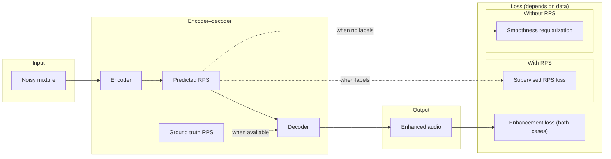

# Drone / Harmonic Noise Suppression

## Progress & research direction

  
    2026-02-10
  

---

# Disclaimer

- **Time has been very tight**
- Full-time project at work with a **March deadline** is pressing
- I could spend **less than one working day per week** on this research
- Hence, I failed to perform all I intended last week
- However, I have formulated a better idea of what to focus on.

---

# Current idea — Overview

We want to use **rotor speed (RPS)** to improve drone noise modelling, but we face a **data imbalance**:

- **Very little** data with ground-truth RPS
- **Much more** drone audio without RPS (including a lot of ground-recorded material)

**Proposed direction**: self-supervised learning so we can use **both** kinds of data and get a model that benefits from RPS when available and still works without it.

The next slides unpack the motivation, the data situation, and the concrete idea.

---

# Motivation: Rotor speeds help

From the paper:

**"Enhancing drone audition with rotor-conditioned deep models"**

- Introducing **rotor speeds (RPS)** as a conditioning signal improves model performance
- Rotation-induced noise is physically tied to rotor RPM
- Conditioning on RPS lets the model use this structure explicitly

**Implication**: We want models that can use RPS when we have it.

---

# The data gap

- We have **very little** labelled RPS data; **much more** without (or speed-agnostic).
- **Goal**: Use both — supervised where we have RPS, self-supervision where we don’t.

<table class="gap-table w-full">
<thead><tr><th>Data type</th><th>Dataset / source</th></tr></thead>
<tbody>
<tr>
  <td rowspan="2" class="row-label">**With RPS** ~8.5 min</td>
  <td>DREGON ~5.5 min;</td>
</tr>
<tr><td>Michaels' recordings ~3 min</td></tr>
<tr>
  <td rowspan="6" class="row-label">**Without RPS** ~30 h</td>
  <td>Drone Audio Dataset — Alemadi, S. (2019). GitHub. <a href="https://github.com/saraalemadi/DroneAudioDataset/tree/master">github.com/saraalemadi/DroneAudioDataset</a></td>
</tr>
<tr><td>SPCup 19 Egonoise Dataset — Inria (2019). <a href="http://dregon.inria.fr/datasets/the-spcup19-egonoise-dataset/">dregon.inria.fr/.../the-spcup19-egonoise-dataset</a></td></tr>
<tr><td>DroneNoise Database — Ramos-Romero, C., et al. (2024). Salford. <a href="https://salford.figshare.com/articles/dataset/DroneNoise_Database/22133411">salford.figshare.com/.../22133411</a></td></tr>
<tr><td>AUDROK Drone Sound Data — AUDROK (2023). Mobilithek. <a href="https://mobilithek.info/offers/605778370199691264">mobilithek.info/offers/605778370199691264</a></td></tr>
<tr><td>Sound-Based Drone Fault Classification (MTL) — Yi, W., Choi, J.-W., & Lee, J.-W. (2023). Zenodo. <a href="https://doi.org/10.5281/zenodo.7779574">doi.org/10.5281/zenodo.7779574</a></td></tr>
</tbody>
</table>

---

# Core idea: Encoder predicts speed

- Use an **encoder–decoder** style architecture (e.g. built on RPS-DCCRN or similar).
- The **encoder** is tasked with **predicting rotor speed(s)** from the mixture (or from a representation of it).
- **Decoder** is conditioned on speed: when **ground-truth RPS** is available, we **replace** the decoder’s speed input with it; otherwise we use the **predicted** RPS.
- Predicting RPS is an **auxiliary task** that encourages the model to internalise rotation-related structure.

When we have **ground-truth RPS**: train the encoder with a **supervised loss** (e.g. regression or classification over RPS).

When we **don’t have RPS**: use a **regularization loss** that encourages the predicted speed to be **temporally smooth** (e.g. not change too much across short windows).

---
layout: center
---

# High-level architecture

  Decoder receives <strong>ground-truth RPS</strong> when available, else <strong>predicted</strong> RPS. With RPS → supervise encoder; without → regularize for smoothness.

---

# Loss design (summary)

| Data | Loss | Example |
|------|------|--------|
| **With RPS** | **Supervised loss** — match predicted speed(s) to ground truth | L2: $\|\hat{r} - r^*\|^2$ |
| **Without RPS** | **Regularization loss** — temporal smoothness (first- & second-order diff.) | $\lambda_1 \|\Delta\hat{r}\|^2 + \lambda_2 \|\Delta^2\hat{r}\|^2$ |

- Same encoder sees both types of data.
- With RPS: learn to predict real RPM.
- Without RPS: learn a stable, physically plausible “pseudo-speed” that still helps the decoder.
- *Notation:* $\hat{r}$ predicted speed, $r^*$ ground truth; $\Delta\hat{r}$ first-order diff., $\Delta^2\hat{r}$ second-order (weights $\lambda_1$, $\lambda_2$).

---

# Why this could help

1. **Single model for both settings**
   - Can be used **with** RPS (conditioning on measured or predicted speed).
   - Can be used **without** RPS (encoder predicts speed; decoder uses it or we use a default).
   - Deployable in scenarios where RPS is sometimes available and sometimes not.

2. **Better use of physics**
   - Encoder is encouraged to explain the mixture in terms of rotation.
   - Internal representation of “speed” should be closer to the physical cause of rotor noise.
   - May lead to **better reduction of rotation-induced noise** than a model that never sees or predicts RPS.

---

# Next steps (concise)

1. **Replicate the paper with RPS-only data**
   - Reproduce results from “Enhancing drone audition with rotor-conditioned deep models” (or the chosen RPS-DCCRN baseline) using only the ~8.5 min of RPS-labelled data.
   - Establishes a baseline and validates the pipeline.

2. **Implement the self-supervised RPS model**
   - Implement the encoder (predict RPS) + decoder (enhancement) with:
     - Supervised RPS loss when labels exist.
     - Temporal smoothness (or similar) regularization when they don’t.
   - Train on the **mixed** dataset (RPS + no-RPS).
   - Compare to the RPS-only baseline to see if mixed training improves performance.

---

# Summary

- **Disclaimer**: Limited time (work deadline in March); progress is incremental.
- **Motivation**: RPS conditioning helps; we want to exploit it despite limited RPS labels.
- **Idea**: Encoder predicts speed; supervised loss when RPS is available, regularization (e.g. smoothness) when it isn’t; single model for both regimes.
- **Next**: Replicate paper on RPS-only data, then implement and train the self-supervised RPS model on mixed data and evaluate.

  Questions and suggestions welcome.

