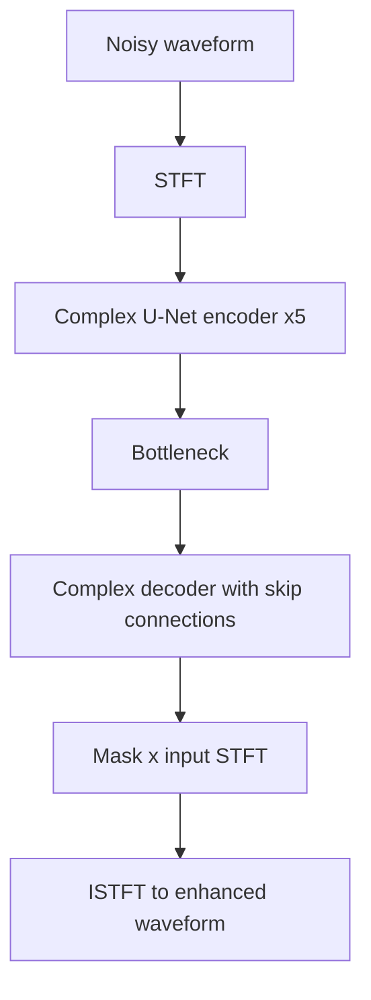
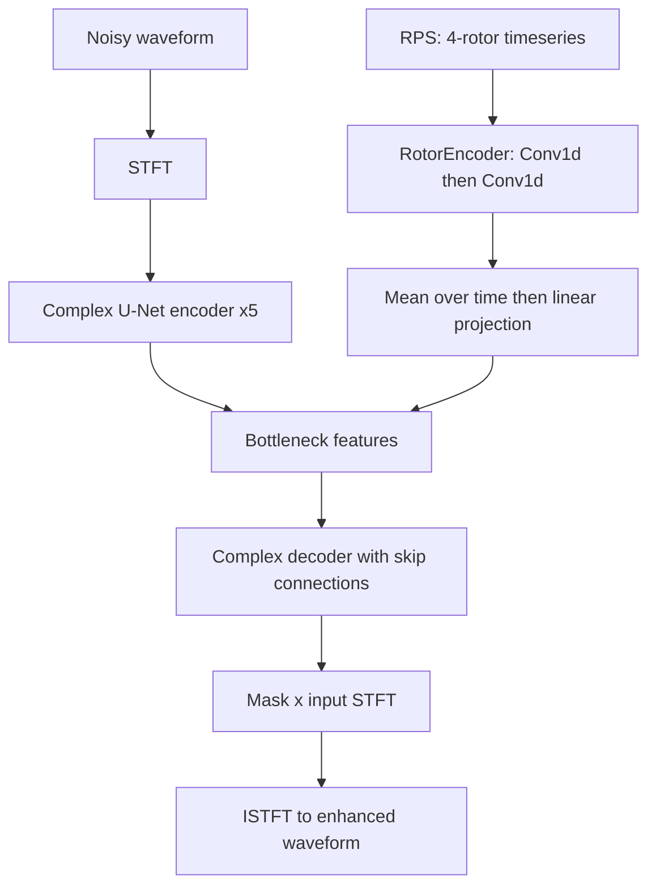
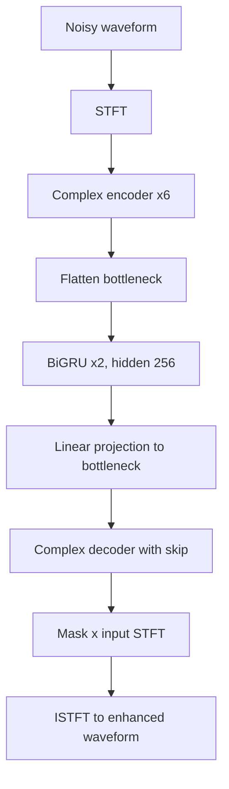
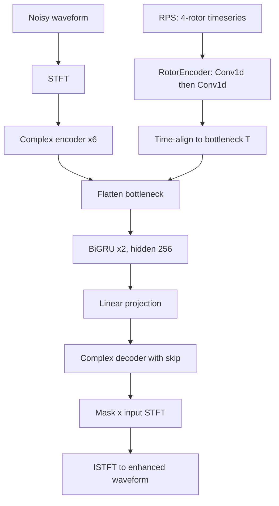
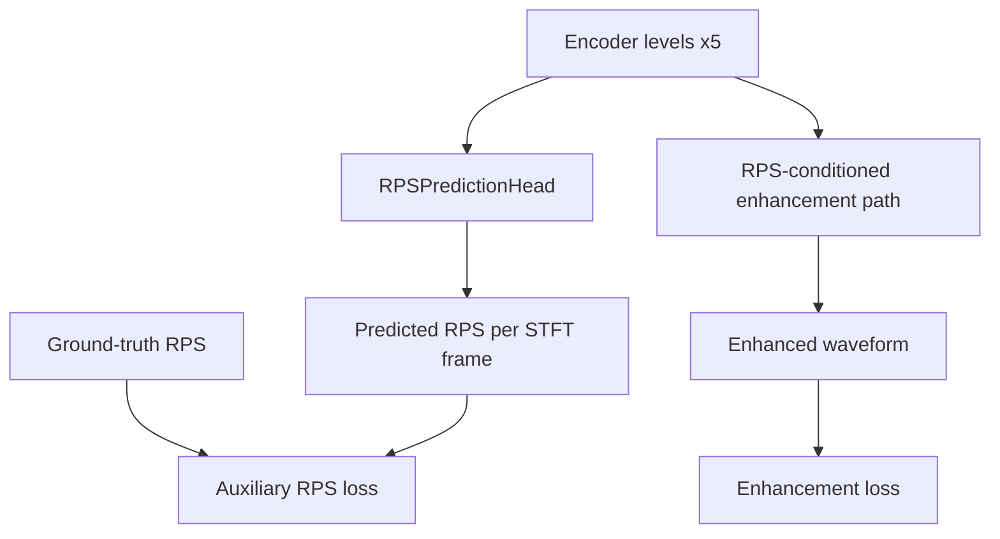
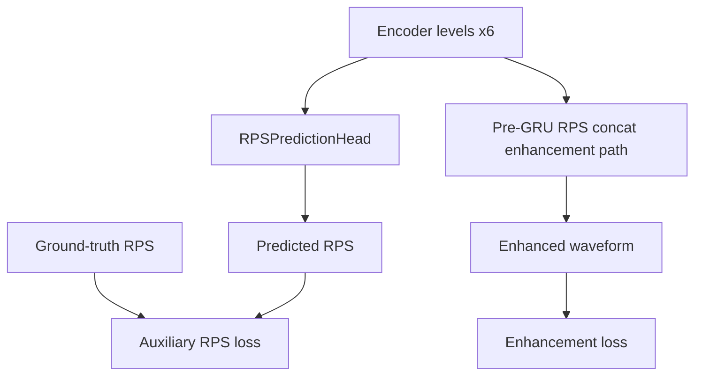
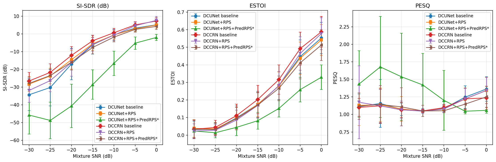

# DREGON Experiment Update
## Rotor-Conditioned Speech Enhancement

DCUNet and DCCRN partial replication of:
*Enhancing drone audition with rotor-conditioned deep models*

---

# 1) Completed Experiment Set (Batch 1)

## Objective
- Compare baseline vs rotor-conditioned variants on DREGON-LibriMix
- Models: `DCUNet` and `DCCRN`
- Inputs: noisy waveform (always), optional RPS (`use_rps`)
- Configs:
  - `configs/7b_DCUNet_baseline_DREGON.yaml`
  - `configs/7a_DCUNet_RPS_DREGON.yaml`
  - `configs/10a_DCCRN_baseline_DREGON.yaml`
  - `configs/10b_DCCRN_RPS_DREGON.yaml`

---

# Batch 1 Setup Notes

- Same dataset split and training schedule across baseline/RPS pairs
- RPS-enabled runs use `num_rotors: 4`, `rps_length: 8500`
- Target: vocals enhancement at ultra-low SNR
- Purpose: partial replication of rotor-conditioned gains from DREGON paper

---

# DCUNet: without RPS vs with RPS

### Without RPS

- No rotor path — `dcunet_num_encoder_layers: 5`

### With RPS (bottleneck fusion)

- `dcunet_rps_fusion: bottleneck`

---

# DCCRN: without RPS vs with RPS

### Without RPS

- No rotor path

### With RPS (pre-GRU concat)

- RPS concatenated before bottleneck GRU

---

# 2) Running Experiment Set: + PredRPS Auxiliary Loss

## New idea
- Keep RPS-conditioned enhancement path
- Add auxiliary task: predict rotor RPS from encoder features (`predict_rps: true`)
- Joint objective: enhancement loss + weighted RPS prediction loss (`rps_aux_weight`)

## Configs currently running
- `configs/7c_DCUNet_RPS_PredRPS_DREGON.yaml`
- `configs/10d_DCCRN_RPS_PredRPS_DREGON.yaml`

## Loss weighting in current configs
- DCUNet: `rps_aux_weight: 0.5`
- DCCRN: `rps_aux_weight: 2.0`

---

# PredRPS in DCUNet (Running)

- Prediction head is FPN-like over encoder scales
- Config: `configs/7c_DCUNet_RPS_PredRPS_DREGON.yaml`
- Total training objective combines enhancement + auxiliary losses

---

# PredRPS in DCCRN (Running)

- Config: `configs/10d_DCCRN_RPS_PredRPS_DREGON.yaml`
- Goal: encourage rotor-aware latent representations

---

# 3) Current Results (Batch 1)

## Per-SNR comparison

Source:
- `assets/per_snr_comparison.png`
- `assets/dregon_per_snr_comparison.csv`

---

# 3) Current Results (Batch 1): Overall Metrics

### Overall metrics from CSV (600 samples)

<table>
  <thead>
    <tr><th>Model</th><th>SI-SDR</th><th>eSTOI</th><th>PESQ</th></tr>
  </thead>
  <tbody>
    <tr><td>DCUNet baseline</td><td>-9.3224</td><td>0.2401</td><td>1.1462</td></tr>
    <tr><td>DCUNet + RPS</td><td>-7.5920</td><td>0.2374</td><td>1.1379</td></tr>
    <tr><td>DCUNet + RPS + PredRPS*</td><td>-25.3389</td><td>0.1323</td><td>1.3298</td></tr>
    <tr><td>DCCRN baseline</td><td>-5.6759</td><td>0.2666</td><td>1.1246</td></tr>
    <tr><td>DCCRN + RPS</td><td>-7.9758</td><td>0.2419</td><td>1.1369</td></tr>
    <tr><td>DCCRN + RPS + PredRPS*</td><td>-8.4733</td><td>0.2255</td><td>1.1145</td></tr>
  </tbody>
</table>

### Notes
- DCUNet: RPS improves SI-SDR (+1.73 dB), but PredRPS* currently collapses SI-SDR
- DCCRN: RPS and PredRPS* both underperform baseline on SI-SDR in this batch
- `*` PredRPS runs likely need further investigation (see next slide)

---

# Next Steps

- This week: finish investigating `PredRPS` runs:
  - Test exact encoder parts of DCUNet and DCCRN on the task of only predicting motor speeds. Compare with previous simple RPS predictor model. Achieve good motor speed prediction performance.
  - Investigate possible training setup discrepancies / errors in loss scaling
  - Re-run the training; also train DCCRN+RPS for more epochs to achieve parity in the number of steps between training runs.

- Next week:
  - Schedule more experiments (include diffusion models?)
  - Fix the list of models and the dataset compositions to fully cover throughout April
  - Establish more frequent sync iterations.
