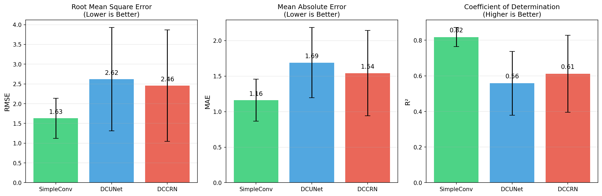
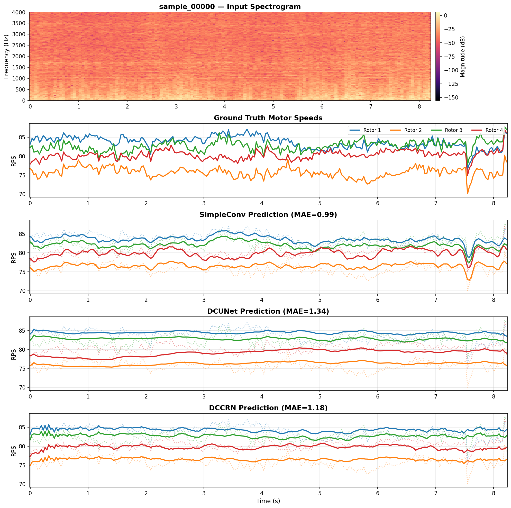
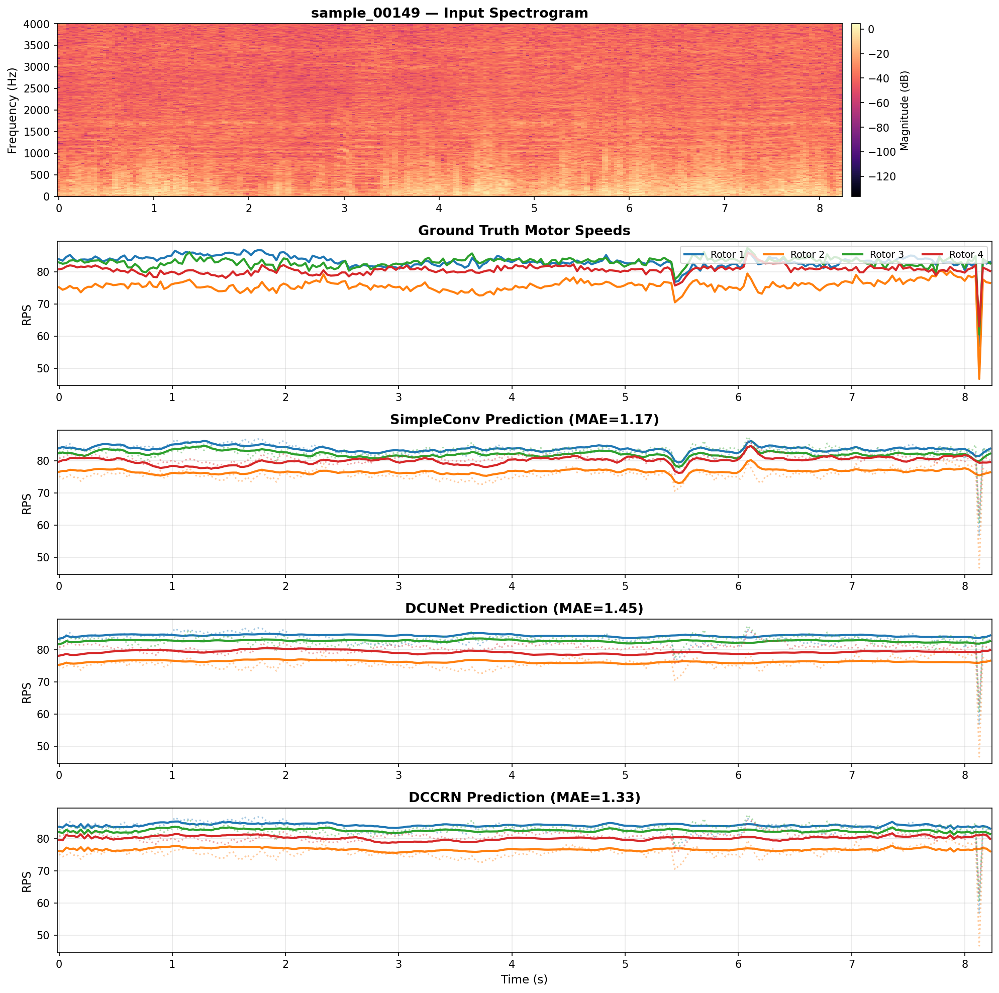
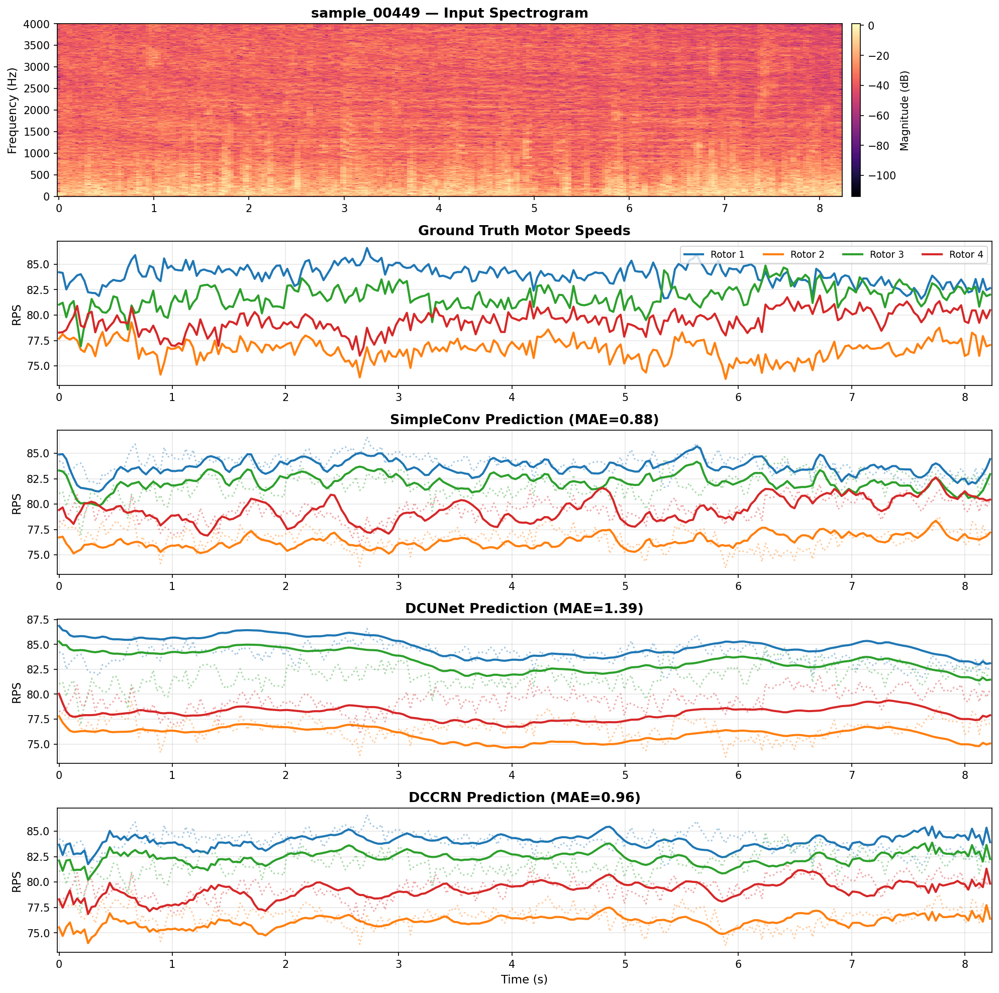
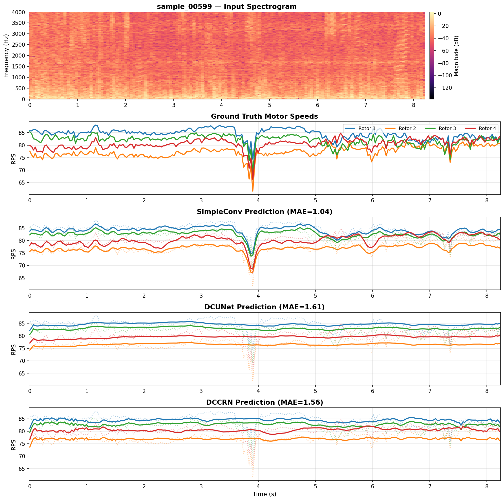

# RPS Prediction for Drone Speech Enhancement

## April 14, 2026

**Harmonic Noise Suppression Project**

---

# Why This Experiment

- Multi-task training (`denoising + RPS prediction`) was much worse than baseline.
- Question: is RPS prediction itself broken for `DCUNet` / `DCCRN` encoders?
- So we isolated pure RPS prediction and compared against `SimpleConv`.

---

# What I Have Been Doing

- RPS prediction with `DCUNet` / `DCCRN` encoders vs `SimpleConv` baseline
- Goal: identify architectural limitations affecting motor-speed prediction
- In parallel: debug and restart multi-task experiments (`WIP`)

---

# RPS Predictor Architectures

  

    
SimpleConv

    

      Log-Mag STFT 
      ↓ 
      Real Conv Blocks 
      ↓ 
      FPN Head 
      ↓ 
      4-Rotor RPS
    

  

  

    
DCUNet Encoder + RPS Head

    

      Complex STFT 
      ↓ 
      DCUNet Encoder 
      ↓ 
      FPN Head 
      ↓ 
      4-Rotor RPS
    

  

  

    
DCCRN Encoder + RPS Head

    

      Complex STFT 
      ↓ 
      DCCRN Encoder 
      ↓ 
      FPN Head 
      ↓ 
      4-Rotor RPS
    

  

---

# Metrics (5 Validation Samples)

| Model | RMSE ↓ | MAE ↓ | R² ↑ |
|-------|--------|-------|------|
| **SimpleConv** | **1.63** | **1.16** | **0.82** |
| DCUNet | 2.62 | 1.69 | 0.56 |
| DCCRN | 2.46 | 1.54 | 0.61 |

---

  

    

      
sample_00000

      
    

    

      
sample_00149

      
    

  

---

  

    

      
sample_00449

      
    

    

      
sample_00599

      
    

  

---

# Main Result

- `DCUNet` / `DCCRN` encoders with attached RPS heads are worse than `SimpleConv`
- This supports the hypothesis that these encoder setups are not ideal for RPS prediction

---

# Critical Issues Found in Initial Multi-Task Setup

- Ground-truth RPS was injected at the **encoder** while the encoder also predicted RPS
- This made the auxiliary prediction objective partially meaningless
- RPS output was not normalized
- RPS loss dominated encoder updates and destabilized training dynamics

---

# Why We Restarted Multi-Task Experiments

- The RPS predictor comparison gave a real signal: architecture matters
- But the first multi-task setup had severe confounders
- We fixed those issues and relaunched experiments (`WIP`)
- Detailed multi-task results will follow later

---

# Current Training Dynamics (Restarted Multi-Task)

  

    
    
  

  

    - `DCCRN (RPS+denoising, debugged)` appears on track to at least match the DREGON baseline. 
    - `DCUNet (RPS+denoising, debugged)` still appears to underperform and likely needs further architectural/debugging work.
  

---

# Next Steps

- Progress has been bad last month: I still had issues to finish up on the job I'm leaving
- But we have 1.5 months more for more focused research due to interruption extension
- Experimental directions to tackle before 18 May (arrival to London, end of extended interruption):
  - Still, diffusion models
  - Transformer architectures replacing convolutional architectures
  - Achieve good results separately on RPS prediction and on noise generation; then try to combine obtained RPS predictor and noise generator into the denoising model

Main issue is lack of continuous worktime spent on research still. There has not been a full day which I could entirely spend thinking about the research yet. Expectation of good progress in such a regime was incorrect. I spend too much time debugging experiment issues due to using AI for quick implementation, negating speed-ups from AI use.
