# RPS Prediction for Drone Speech Enhancement

## April 14, 2026

**Harmonic Noise Suppression Project**

---

# Motivation: Why Predict Rotor Speed?

## Rotor Per-Second (RPS) Conditioning

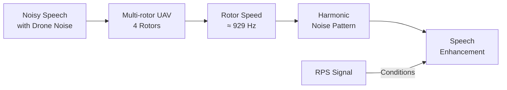

**Key insight**: Drone noise harmonics depend directly on rotor speed. Providing RPS as a conditioning signal helps models better separate speech from noise.

---

# RPS Prediction Models Evaluated

## Three Architectures Compared

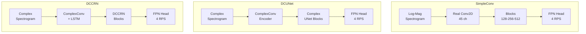

---

# Evaluation Results: Metrics Comparison

## 5 Random Validation Samples from DREGON-LM


| Model | RMSE ↓ | MAE ↓ | R² ↑ |
|-------|--------|-------|------|
| **simple_conv** | **1.52** | **1.17** | **0.84** |
| dcunet | 2.20 | 1.75 | 0.67 |
| dccrn | 2.16 | 1.69 | 0.68 |

**Finding**: SimpleConv baseline outperforms complex encoder models!

---

# Evaluation Results: Time Series Comparison

## RPS Predictions vs Ground Truth

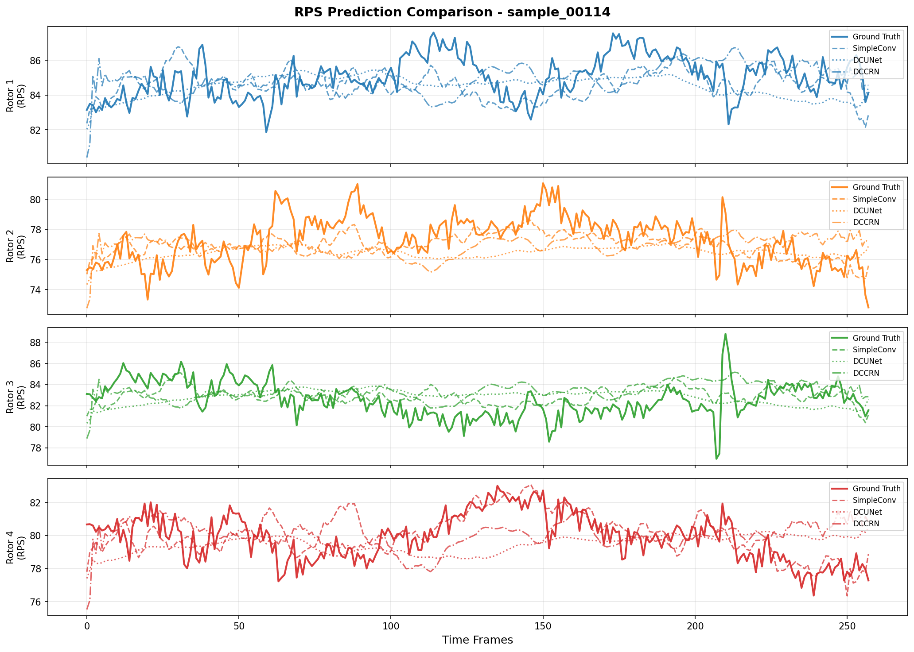

**Observation**: All models capture the general trend, but SimpleConv has less variance in predictions.

---

# Sample-by-Sample Performance

## Individual Sample Metrics

<div class="grid grid-cols-3 gap-4">

<div>

### Sample 00114
| Model | MAE |
|-------|-----|
| SimpleConv | 1.04 |
| DCUNet | 1.38 |
| DCCRN | 1.40 |

</div>

<div>

### Sample 00025
| Model | MAE |
|-------|-----|
| SimpleConv | 1.32 |
| DCUNet | 2.11 |
| DCCRN | 2.19 |

</div>

<div>

### Sample 00250
| Model | MAE |
|-------|-----|
| SimpleConv | 0.92 |
| DCUNet | 1.38 |
| DCCRN | 1.15 |

</div>

</div>

---

# Why Does SimpleConv Outperform?

## Analysis

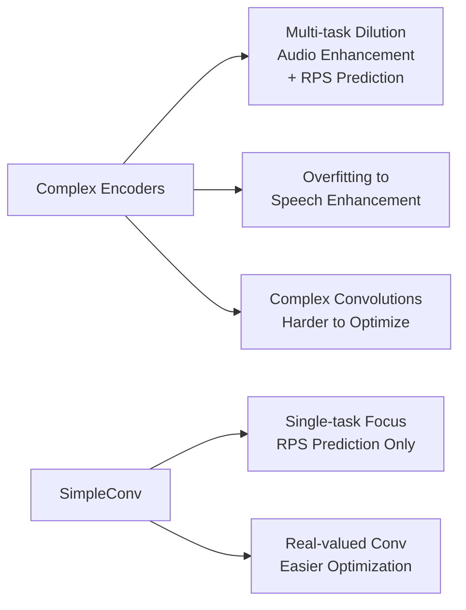

**Hypotheses**:
1. Complex models are optimized for speech enhancement, not RPS prediction
2. Multi-task learning dilutes RPS prediction performance
3. Real-valued convolutions may be easier to optimize for this task

---

# New Architecture: Refactored Models

## Decoder-Only RPS Injection

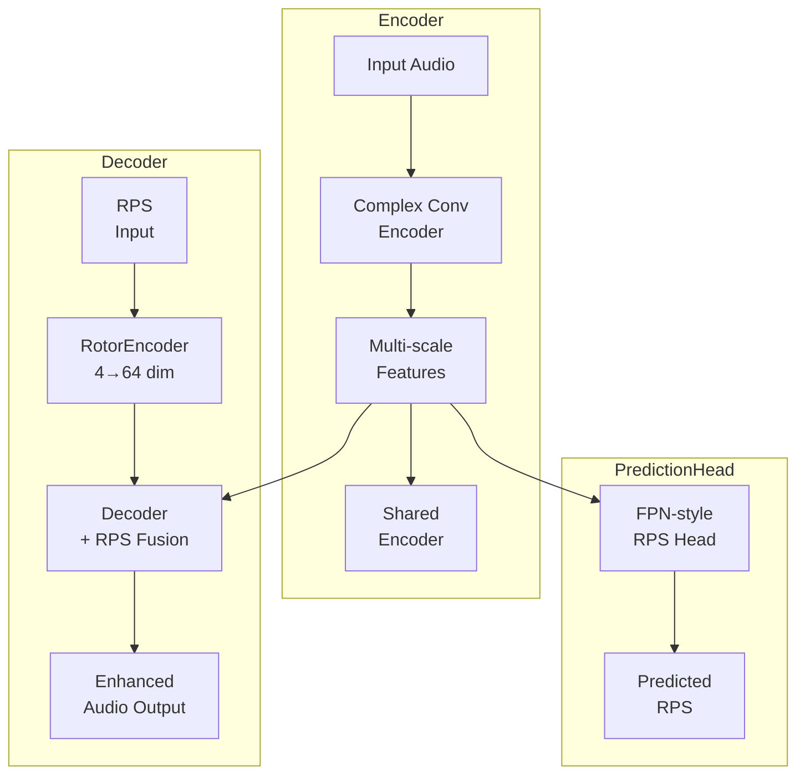

**Key change**: RPS conditioning is now **decoder-side only**, not encoder-side.

---

# Decoder RPS Fusion Strategies

## Bottleneck vs Hierarchical

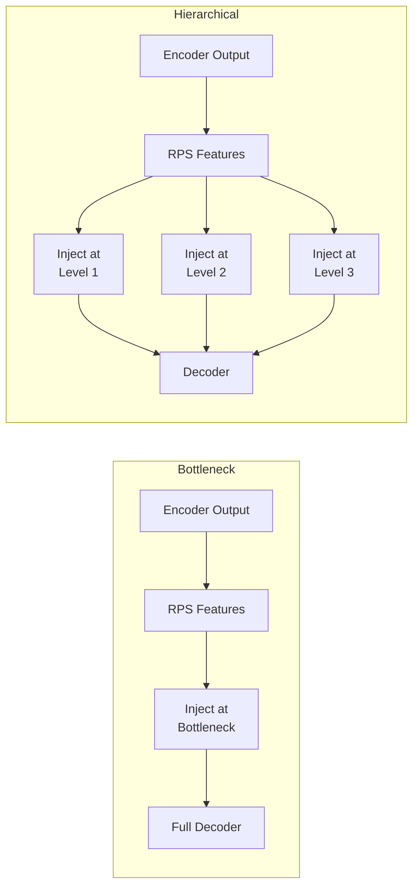

- **Bottleneck**: Single injection point at start of decoder
- **Hierarchical**: Distributed injection at multiple decoder levels

---

# Multi-Task Learning Setup

## Auxiliary RPS Prediction with FPN Head

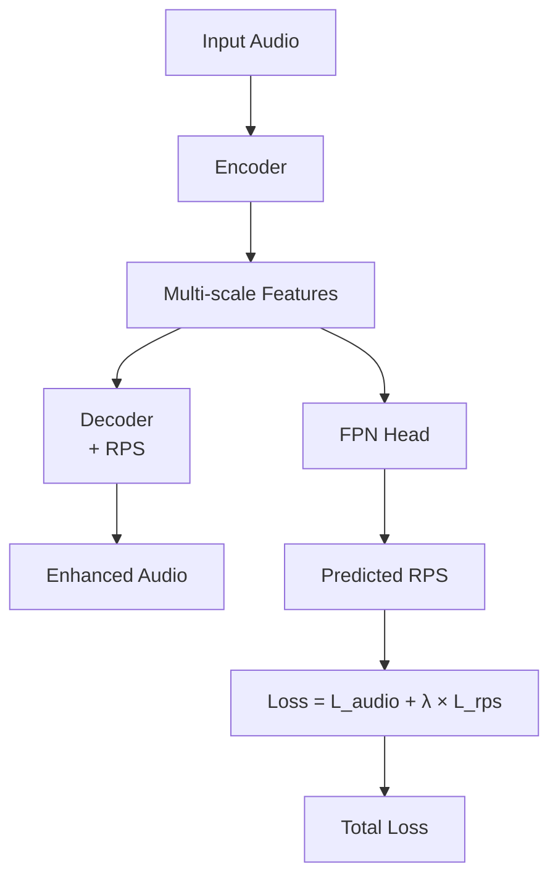

**Configuration**:
- `predict_rps: true`
- `rps_aux_weight: 0.1`
- λ = 0.1 (auxiliary loss weight)

---

# Current Training Experiments

## Running on Vast-Server GPUs

| Job ID | Model | Strategy | GPU | Status |
|--------|-------|----------|-----|--------|
| 3b21a556e127 | DCUNetRefactored | Bottleneck | 0 | Training |
| 2d3a2c6bcaa5 | DCUNetRefactored | Hierarchical | 1 | Training |
| 8d03823364d9 | DCCRNRefactored | Bottleneck | - | Queued |
| 25922d874184 | DCCRNRefactored | Hierarchical | - | Queued |

**Dataset**: DREGON-LM (DREGON + LibriMix)
- 6000 training samples, 8.224s each
- Real motor telemetry from DREGON dataset

---

# Experiment Configuration

## Config Files Created

```
configs/
├── 13a_DCUNetRefactored_PredRPS_bottleneck.yaml
├── 13b_DCUNetRefactored_PredRPS_hierarchical.yaml
├── 13c_DCCRNRefactored_PredRPS_bottleneck.yaml
└── 13d_DCCRNRefactored_PredRPS_hierarchical.yaml
```

**Key settings**:
- `use_rps: true` (decoder-side only)
- `predict_rps: true` (auxiliary RPS prediction)
- `rps_aux_weight: 0.1`
- `dcunet_rps_fusion: bottleneck` / `hierarchical`

---

# Visualizations: Sample Plots

## Spectrogram + RPS Time Series

<div class="grid grid-cols-2 gap-4">

<div>

### Sample 00114

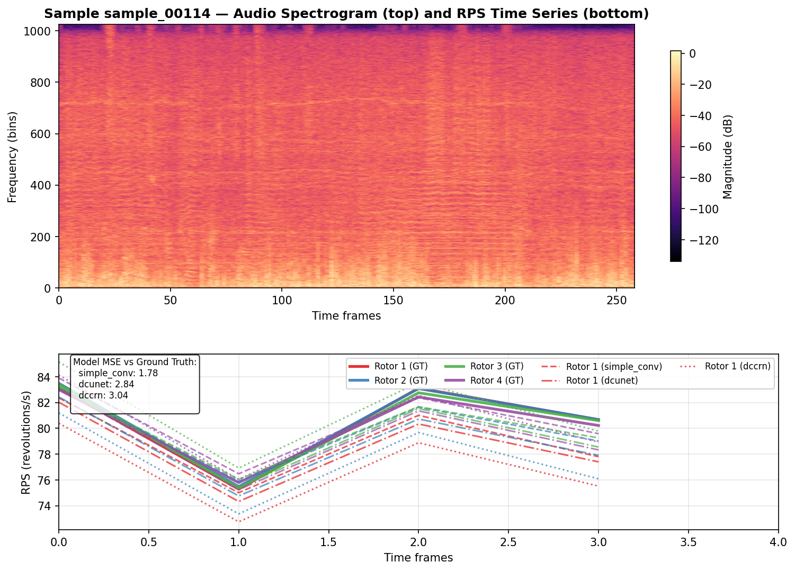

</div>

<div>

### Sample 00025

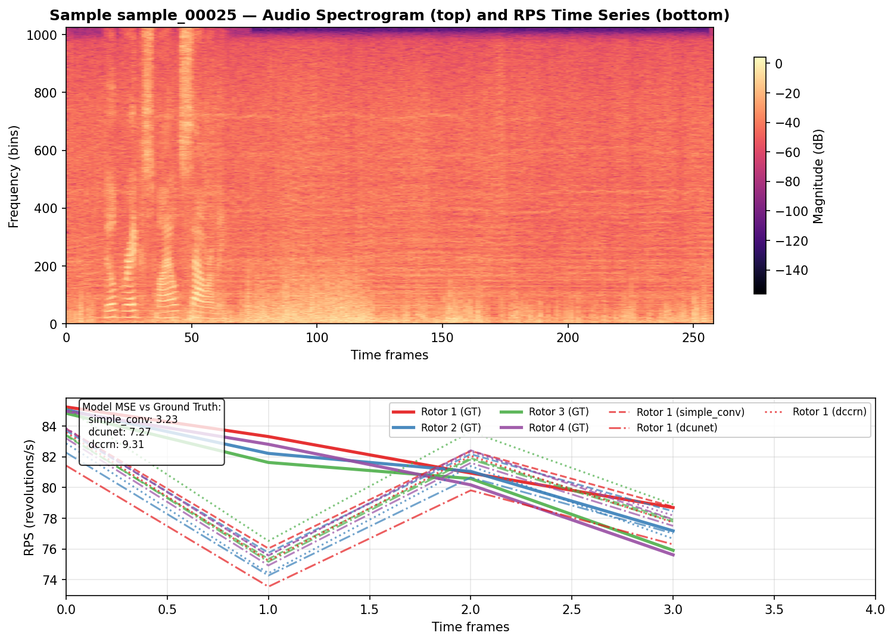

</div>

</div>

---

# Visualizations: More Samples

## Samples 00250 and 00281

<div class="grid grid-cols-2 gap-4">

<div>

### Sample 00250

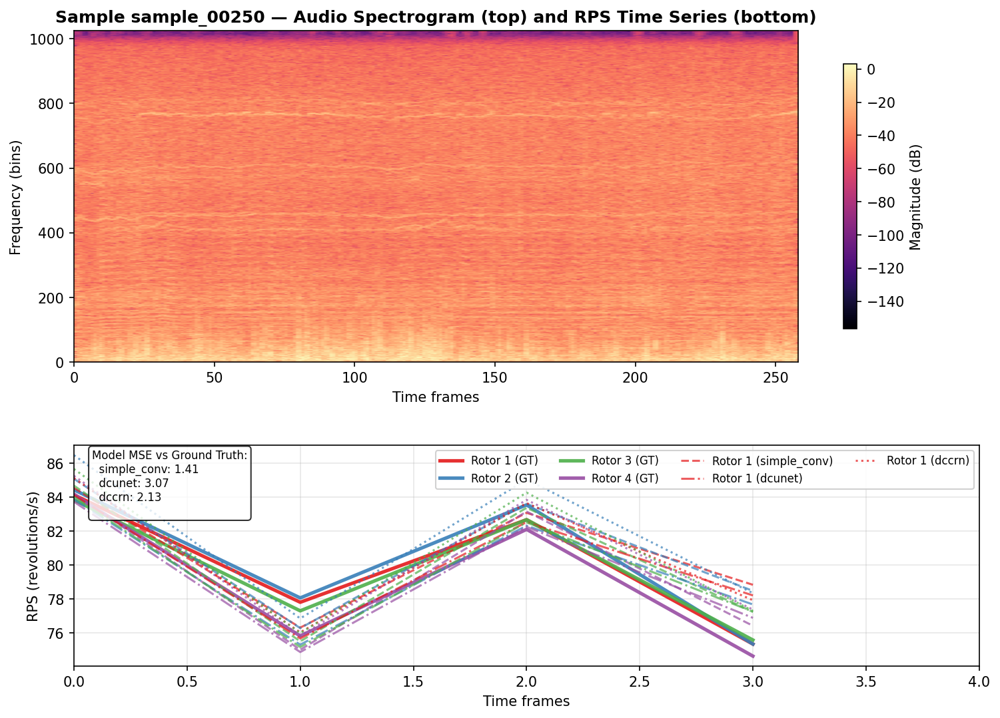

</div>

<div>

### Sample 00281

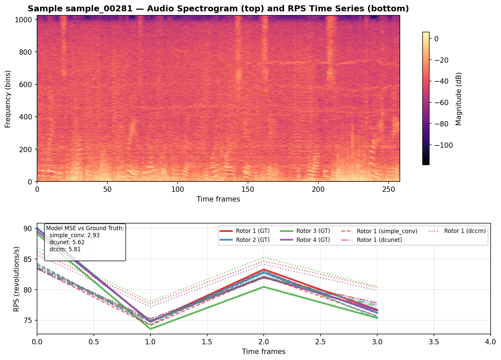

</div>

</div>

---

# Next Steps

## Planned Work

1. **Wait for training completion** (24h max duration)
2. **Evaluate refactored models** on DREGON-LM validation set
3. **Compare with baselines**:
   - DCUNet baseline (no RPS)
   - DCUNet with encoder-side RPS (old approach)
4. **Analyze RPS prediction accuracy** from auxiliary head
5. **Final evaluation** with metrics: SI-SDR, PESQ, STOI, ESTOI

---

# Summary

## Key Takeaways

✅ **RPS prediction evaluation completed** for 3 models on 5 samples

✅ **SimpleConv outperforms complex models** in RPS prediction:
- RMSE: 1.52 vs 2.20/2.16
- R²: 0.84 vs 0.67/0.68

✅ **Refactored DCUNet/DCCRN** with decoder-only RPS injection

✅ **4 training experiments submitted** via postdoc

⏳ **Training in progress** — results expected soon

---

# Thank You

## Questions?

**Project**: Harmonic Noise Suppression  
**Date**: April 14, 2026  
**Contact**: flyingleafe

