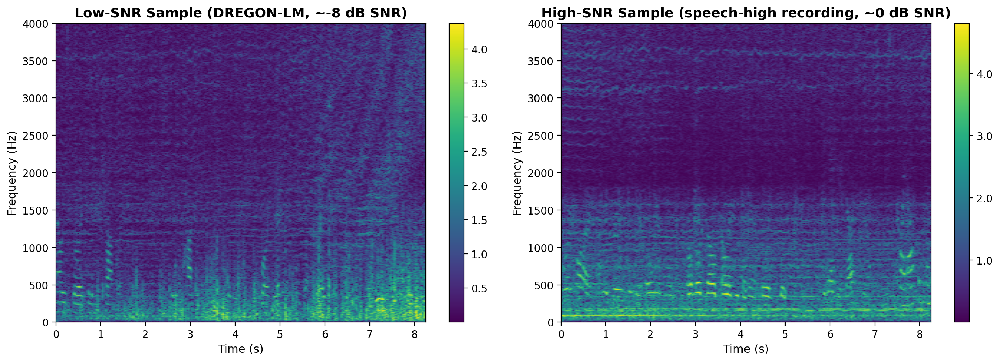
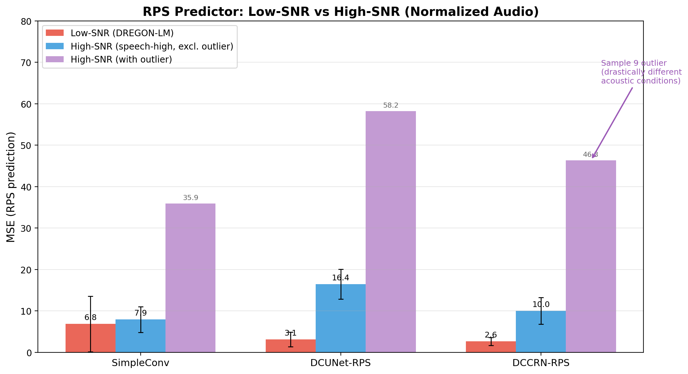
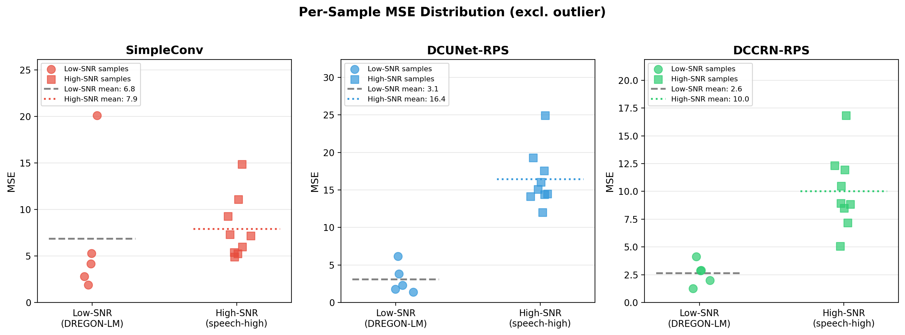
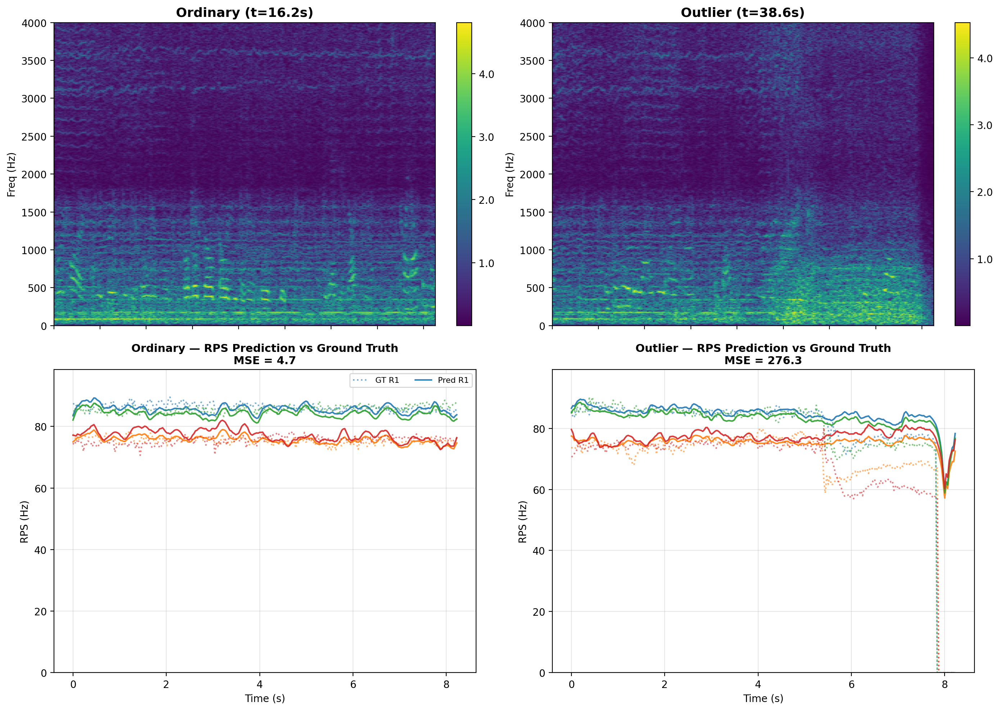
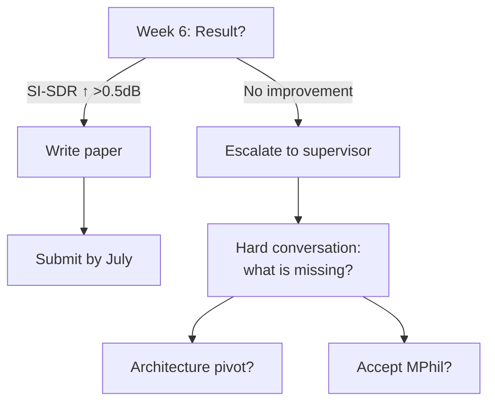

# Harmonic Noise Suppression

## Progress Update — 05 May 2026

---

# Topics

1. A bit of experiments since last presentatoin
2. What is the overall plan until write-up?

---

# First, a bit of evaluations

Answering the question - if RPS predictors perform well on high-SNR samples (with pronounced speeds)

---

# Research Question

## How do RPS predictors perform on **high-SNR** samples?

 

- Current evaluation focuses on **low-SNR** synthetic mixtures (-30 to 0 dB)
- Real-world scenarios include **high-SNR** recordings where speech is strong
- Question: *Does RPS conditioning help or hurt when speech dominates?*

 

**Hypothesis**: RPS predictors may struggle when speech masks rotor harmonics

## Spectrogram Comparison

Left: Low-SNR — drone harmonics clearly visible below 1 kHz 
Right: High-SNR — speech energy masks rotor harmonics

---

# Answer: Moderate Degradation at High-SNR

## Key Finding (Normalized Audio)

 

After correcting for audio level differences:

| Model | Low-SNR MSE | High-SNR MSE | Ratio |
|-------|-------------|--------------|-------|
| **SimpleConv** | **6.8** | **7.9** | **1.2×** |
| DCUNet-RPS | 3.1 | 16.4 | 5.3× |
| DCCRN-RPS | 2.6 | 10.0 | 3.8× |

 

**SimpleConv is SNR-robust** — only 1.2× degradation at high SNR.

**Encoder-based models** (DCUNet, DCCRN) degrade more significantly.

## MSE Comparison

Purple bars include one outlier sample (t≈38s) with drastically different acoustic conditions.

---

# Per-Sample Analysis

 

**Observation**: Most high-SNR samples cluster near the low-SNR average. SimpleConv (left) shows the tightest distribution around its low-SNR baseline, confirming its robustness.

---

# Outlier Investigation

**Ordinary** (t=16.2s): MSE = 4.7 — predictions track GT well

<audio controls class="w-full">
  <source src="./assets/ordinary_audio.wav" type="audio/wav">
</audio>

**Outlier** (t=38.6s): MSE = 276 — GT drops to 0 at t≈8s (drone landing), but model predicts steady ~80 Hz

<audio controls class="w-full">
  <source src="./assets/outlier_audio.wav" type="audio/wav">
</audio>

**Implication**: RPS prediction reliability varies with recording conditions, not just SNR. Models need awareness of flight state.

---

# Now, the elephant in the room

Bad news:
- I did not manage to make proper progress before my return to the UK
- Turns out, it is hard to do meaningful science while working full-time and traveling around at the same time!

Good news:
- I guess my write-up transfer deadline is right around Christmas now (1.5 months later)

How much time is left and what can realistically be done in this time?

---

# What the Supervisor Actually Said

"Stop making plans. Start getting publishable results."

### The Feedback

- Annoyed that months have been spent on **planning** with **no paper**
- Current priority: **beat SOTA on some domain ASAP**
- Timeline: **1.5–2 months** if truly focused
- **Submit a paper first.** Then think about MIMII, thesis framing, or transfer.

### What This Means

- MIMII / cross-domain (C3) is **secondary**
- The 3-bet portfolio is **distraction** — pick one
- "Plan D" benchmark study is **not a paper**
- We need **one result that beats a number**, not a theory

---

# The One Thing That Matters

## What is our current best shot at beating SOTA?

### What we have now

- **DREGON-LM** dataset (real drone recordings + mixed speech)
- **RPS-conditioned SE models** (DCUNet-RPS, DCCRN-RPS, SimpleConv-RPS)
- **Oracle RPS** gives improvement over blind baselines
- **Paper 1** published on DN-LM (band-split RoPE Transformer)

### The gap

- Current RPS models are **not yet beating SOTA** on DREGON-LM
- Pseudo-RPS / multi-task are **unproven**
- We have **no submission-ready figure**

Brutal truth

The "current approach" the supervisor refers to is likely <strong>RPS-conditioned SE</strong> (Paper 2 direction). We need to make it <strong>actually work</strong> and <strong>beat a number</strong> on DREGON-LM. That is the domain. Not MIMII. Not theory.

Novelty claim: "RPS conditioning improves SE under harmonic noise" — but only if the number is better.

---

# The 6-Week Sprint (May – mid-June)

### Goal: One result that beats SOTA on DREGON-LM

**Week 1–2 (Now – May 19)**
- Audit current best model on DREGON-LM: what is the SI-SDR?
- Run full eval against blind SOTA baseline (TF-GridNet? DPTNet?)
- Identify the gap: where exactly do we lose?

**Week 3–4 (May 19 – June 2)**
- Fix the gap. Options:
  - Better RPS fusion (concat vs FiLM vs cross-attn)
  - Stronger backbone (replace DCCRN/DCUNet with TF-GridNet + RPS)
  - Training tricks: longer training, better augmentation, loss tuning
- Run 2–3 promising variants

**Week 5–6 (June 2 – June 16)**
- Evaluate winner at −30, −20, −10, 0 dB
- Ablations: RPS vs no RPS, oracle vs pseudo
- Generate paper-ready figures (SI-SDR, STOI, PESQ curves)

Constraint

Only one direction at a time. No parallel bets. If Week 2 shows the gap is >3 dB SI-SDR, we need a bigger architecture change. If gap is <1 dB, we need training scale.

Kill criterion for this sprint

If by Week 4 we have not beaten the blind SOTA by ≥0.5 dB SI-SDR at any SNR → escalate to supervisor immediately. Do not spend Week 5–6 polishing a loss.

6 weeks

Not 30. Not 8. 6.

---

# What Happens After the Sprint

### If we have a win (Week 7–10, mid-June – mid-July)

- Write paper draft (1 week with AI)
- Run cross-dataset validation on DN-LM (1 week)
- Internal review + supervisor sign-off
- **Submit to Interspeech / TASLP / similar** (check deadlines)

### If we do not have a win

- **Escalate to supervisor immediately** — do not hide
- Options: pivot architecture, add data, or accept Plan D
- Supervisor explicitly said 1.5–2 months — that means **8 weeks max** before a hard conversation

The supervisor's 1.5–2 month estimate includes the possibility that it does not work. That conversation must happen by early July, not December.

---

# Immediate Next Actions (This Week)

1. **Today**: Run full eval of best current RPS model vs best blind baseline on DREGON-LM. Get the exact numbers.
2. **By May 9**: Know the gap. Is it 0.5 dB or 5 dB? This determines Week 3–4 strategy.
3. **By May 12**: Have 2 training runs queued: (a) stronger backbone + RPS, (b) longer training of current best.
4. **By May 19**: Know which direction (architecture vs scale) moves the needle.

 

No more planning slides. Only results slides from now on.

