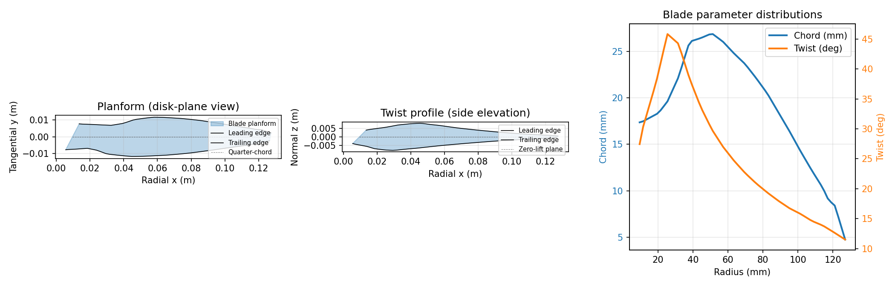
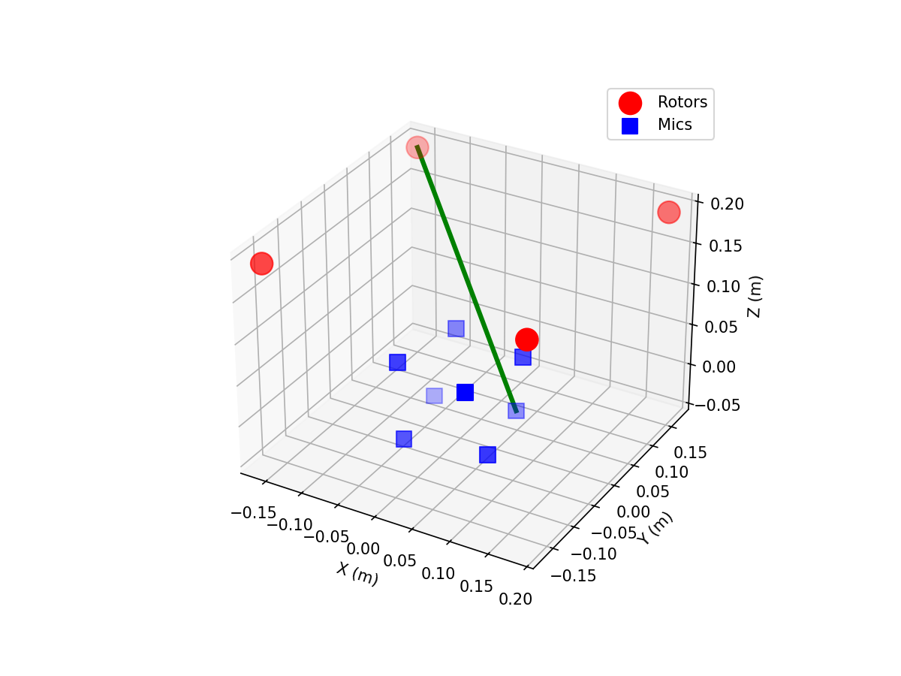
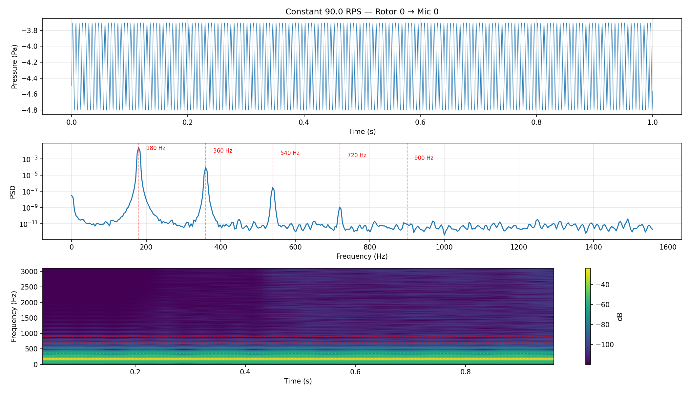
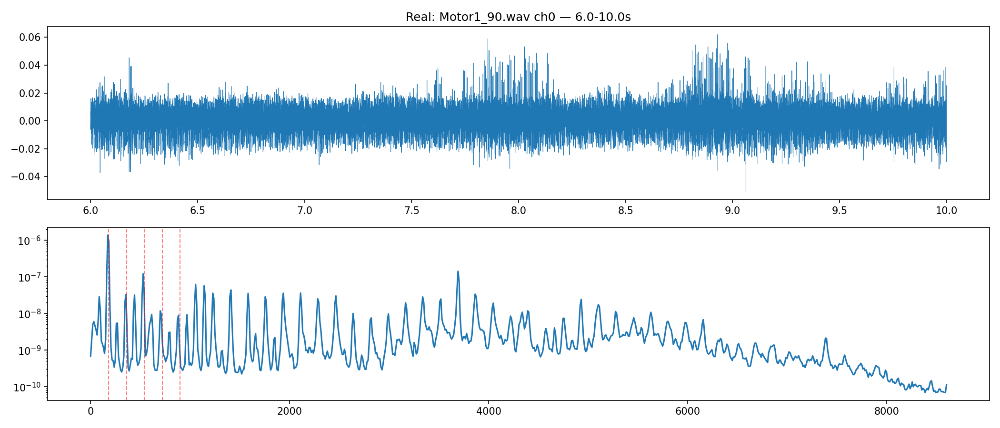
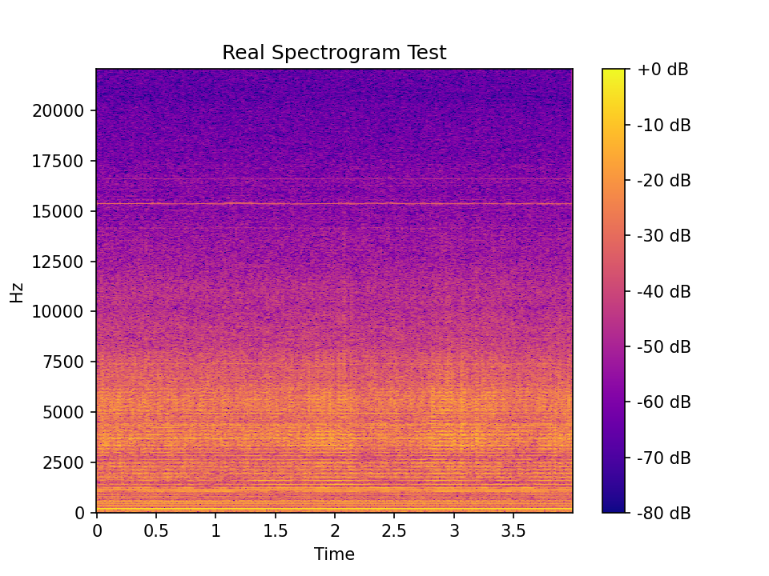

# FWH Rotor Noise Simulator

## Differentiable acoustic prediction from blade geometry + RPM

---

# Why

- Revisited aeroacoustics reading
- Built FWH solver in a weekend to see how close it gets
- First sanity check: does simulated sound match real recordings?

---

# BEMT: Blade Forces

**Blade Element Momentum Theory** — slice blade into radial strips, each a 2D airfoil in combined inflow + rotation.

Local velocity magnitude:
$$V(r) = \sqrt{v_\infty^2 + (\Omega r)^2}$$

Inflow angle + angle of attack:
$$\phi = \arctan\frac{v_\infty}{\Omega r}, \qquad \alpha = \theta(r) - \phi$$

Strip forces:
$$L = \tfrac{1}{2} \rho V^2 c \, C_\ell(\alpha)$$
$$D = \tfrac{1}{2} \rho V^2 c \, C_d(\alpha)$$

Project to disk axes → thrust / torque per strip.

| Symbol | Meaning |
|--------|---------|
| $v_\infty$ | Inflow velocity |
| $\Omega$ | Rotor angular speed |
| $r$ | Radial station |
| $\theta(r)$ | Geometric twist |
| $\phi$ | Inflow angle |
| $\alpha$ | Angle of attack |
| $c$ | Chord length |
| $C_\ell, C_d$ | Lift / drag coeffs |
| $L, D$ | Strip lift / drag |

---

# Ffowcs-Williams Hawkings

**FW-H = Compressible Navier-Stokes rewritten as a wave equation.** Green's function moves all nonlinear terms to the RHS as *acoustic sources*. Observer needs only surface quantities — no volume mesh.

Retarded time:
$$t - \tau = \frac{|\mathbf{x} - \mathbf{y}(\tau)|}{c_0}$$

Farassat 1A:
$$p(\mathbf{x},t) = \frac{1}{4\pi} \left[ \frac{\hat{\mathbf{r}} \cdot \frac{d\mathbf{F}}{d\tau}}{r \,(1 - M_r)^2} \right]_\mathrm{ret}$$

Only **loading noise** — thickness is $O(M^2)$, negligible for drones.

| Symbol | Meaning |
|--------|---------|
| $\mathbf{x}$ | Observer position |
| $\mathbf{y}(\tau)$ | Source position |
| $c_0$ | Speed of sound |
| $\tau$ | Retarded time |
| $\hat{\mathbf{r}}$ | Unit vector $\mathbf{x}-\mathbf{y}$ |
| $\mathbf{F}$ | Strip force (loading) |
| $r$ | Source-observer distance |
| $M_r$ | Mach number in $r$-direction |
| $[\cdot]_\mathrm{ret}$ | Evaluated at retarded time |

---

# Step 1: Blade Motion → Local Forces

**Given:** chord $c(r)$, twist $\theta(r)$, RPM $\Omega(t)$. **Goal:** lift and drag on each strip.

Azimuth (integrated from RPM):
$$\psi(t) = \int_0^t \Omega(t') \, dt'$$

Panel position on the rotating blade:
$$\mathbf{y}(r, \psi) = \big[ r \cos\psi, \; r \sin\psi, \; 0 \big]^\top$$

Local velocity, inflow angle, AoA:
$$V(r) = \sqrt{v_\infty^2 + (\Omega r)^2}, \qquad \phi = \arctan\frac{v_\infty}{\Omega r}, \qquad \alpha = \theta(r) - \phi$$

Lift and drag in the local airfoil frame:
$$L = \tfrac{1}{2} \rho V^2 c \, C_\ell(\alpha), \qquad D = \tfrac{1}{2} \rho V^2 c \, C_d(\alpha)$$

| Symbol | Meaning |
|--------|---------|
| $c(r)$ | Chord distribution |
| $\theta(r)$ | Twist distribution |
| $R$ | Blade tip radius |
| $r$ | Radial station |
| $\Omega(t)$ | Angular velocity |
| $\psi(t)$ | Azimuth angle |
| $\mathbf{y}$ | Panel position |
| $V$ | Local velocity |
| $\phi$ | Inflow angle |
| $\alpha$ | Angle of attack |
| $L, D$ | Lift / drag per strip |

---

# Step 2: Local Forces → Disk Forces

**Given:** lift $L$ and drag $D$ in the local airfoil frame. **Goal:** forces in the rotor disk axes.

The airfoil frame (drag parallel to $V$, lift normal to $V$) is rotated into the disk axes (radial, tangential, thrust) by the inflow angle $\phi$:

$$\begin{bmatrix} F_\text{radial} \\ F_\text{tangential} \\ F_\text{thrust} \end{bmatrix} = \begin{bmatrix} \cos\phi & -\sin\phi \\ \sin\phi & \cos\phi \\ 0 & 0 \end{bmatrix} \begin{bmatrix} D \\ L \end{bmatrix}$$

Written out per component:
$$F_\text{radial} = D \cos\phi - L \sin\phi$$
$$F_\text{tangential} = D \sin\phi + L \cos\phi$$
$$F_\text{thrust} = 0 \;\; \text{(thin-airfoil: no normal force component)}$$

In hover $v_\infty \to 0$, so $\phi \to 0$ and $F_\text{tangential} \approx L$ (thrust ≈ lift). Compact-chord: each strip acts as a point source carrying $\mathbf{F} = [F_r, F_t, 0]^\top$ at $\mathbf{y}(r, \psi)$.

| Symbol | Meaning |
|--------|---------|
| $L$ | Lift (normal to flow) |
| $D$ | Drag (parallel to flow) |
| $\phi$ | Inflow angle |
| $F_\text{radial}$ | Force along blade span |
| $F_\text{tangential}$ | Force in rotation direction |
| $F_\text{thrust}$ | Force normal to disk |
| $\mathbf{F}$ | Strip force vector $[F_r, F_t, 0]^\top$ |
| $\mathbf{y}$ | Strip source position |

---

# Step 3: Disk Forces → Observer Pressure

**Given:** strip forces $\mathbf{F}_{ib}$ at positions $\mathbf{y}_{ib}$. **Goal:** pressure at microphone $\mathbf{x}$.

Retarded time per source (sound travel delay):
$$t - \tau = \frac{|\mathbf{x} - \mathbf{y}_{ib}(\tau)|}{c_0}$$

Each strip radiates as a compact point source (chord $\ll$ wavelength). Sum over $N_r$ strips and $B$ blades:

$$p(\mathbf{x}, t) = \sum_{i=1}^{N_r} \sum_{b=1}^{B} \frac{1}{4\pi} \left[ \frac{\hat{\mathbf{r}}_{ib} \cdot \frac{d\mathbf{F}_{ib}}{d\tau}}{r_{ib} \, (1 - M_{r,ib})^2} \right]_\mathrm{ret}$$

Derivative $d\mathbf{F}/d\tau$ captures the unsteady loading — this is where the BPF harmonics come from. The entire chain is differentiable w.r.t. $c(r)$, $\theta(r)$.

| Symbol | Meaning |
|--------|---------|
| $\mathbf{x}$ | Microphone position |
| $\mathbf{y}_{ib}$ | Strip $i$, blade $b$ position |
| $c_0$ | Speed of sound |
| $\tau$ | Retarded time |
| $\hat{\mathbf{r}}_{ib}$ | Unit vector source → observer |
| $r_{ib}$ | Source-observer distance |
| $M_{r,ib}$ | Mach number in observer direction |
| $[\cdot]_\mathrm{ret}$ | Evaluated at retarded time |
| $p(\mathbf{x},t)$ | Pressure at microphone |
| $N_r$ | Number of radial strips |
| $B$ | Number of blades |

---

# Blade Geometry

APC 10x7 Thin Electric -- real tabulated data

---

# DREGON Setup

8 microphones in cubic array underneath 4 rotors

---

# Simulated -- 90 RPS, Rotor 0 -> Mic 0

Constant speed. Pure tonal harmonics.

---

# Real Recording -- Motor1_90.wav, 6-10 s

Same BPF. Plus broadband noise.

---

# Takeaway

| | Simulated | Real |
|---|---|---|
| **Tonal** | yes BPF + harmonics | yes BPF + harmonics |
| **Broadband** | no | yes turbulent + motor noise |

Next: replace BEMT with VLM/VPM or LBM to capture broadband.

---

# First Goal

Can we deduce the **exact rotor phase** from the **blade passing frequency phase** of real sound?

That is the bet.
